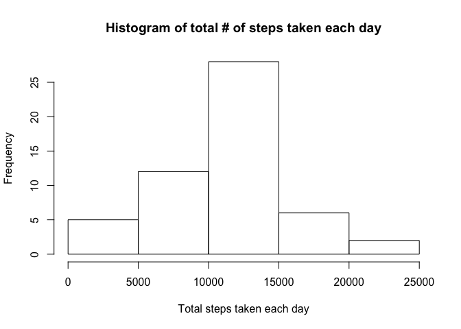
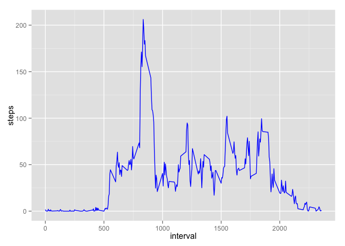
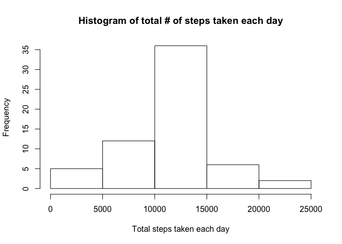
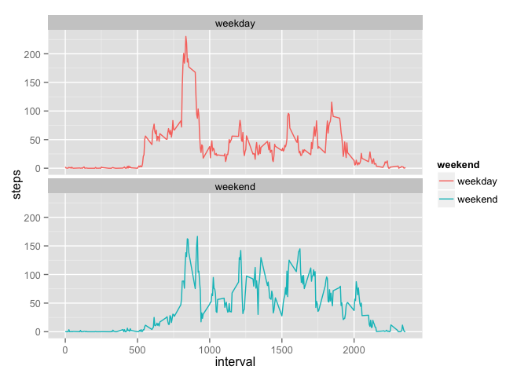

# Reproducible Research Assignment 1
Karon C. Lewis, MSBMS, MPH, DrPHc  
May 10, 2016  

#Loading and Processing Data

```r
library(knitr)
library(dplyr)
```

```
## 
## Attaching package: 'dplyr'
## 
## The following objects are masked from 'package:stats':
## 
##     filter, lag
## 
## The following objects are masked from 'package:base':
## 
##     intersect, setdiff, setequal, union
```

```r
library(magrittr)
library(ggplot2)
library(lubridate)
```

```
## Warning: package 'lubridate' was built under R version 3.2.4
```

```
## 
## Attaching package: 'lubridate'
## 
## The following object is masked from 'package:base':
## 
##     date
```

```r
activity=read.csv(file = "~/Desktop/CourseraCourses/ReproducibleResearch/activity.csv", header=TRUE)
str(activity)
```

```
## 'data.frame':	17568 obs. of  3 variables:
##  $ steps   : int  NA NA NA NA NA NA NA NA NA NA ...
##  $ date    : Factor w/ 61 levels "2012-10-01","2012-10-02",..: 1 1 1 1 1 1 1 1 1 1 ...
##  $ interval: int  0 5 10 15 20 25 30 35 40 45 ...
```

```r
activity$date <- ymd(activity$date)
```

#What is Mean Total Number of Steps Taken per day?
- Calculate the total number of steps taken per day.

```r
sum1=aggregate(steps~date, activity, sum)
sum1
```

```
##          date steps
## 1  2012-10-02   126
## 2  2012-10-03 11352
## 3  2012-10-04 12116
## 4  2012-10-05 13294
## 5  2012-10-06 15420
## 6  2012-10-07 11015
## 7  2012-10-09 12811
## 8  2012-10-10  9900
## 9  2012-10-11 10304
## 10 2012-10-12 17382
## 11 2012-10-13 12426
## 12 2012-10-14 15098
## 13 2012-10-15 10139
## 14 2012-10-16 15084
## 15 2012-10-17 13452
## 16 2012-10-18 10056
## 17 2012-10-19 11829
## 18 2012-10-20 10395
## 19 2012-10-21  8821
## 20 2012-10-22 13460
## 21 2012-10-23  8918
## 22 2012-10-24  8355
## 23 2012-10-25  2492
## 24 2012-10-26  6778
## 25 2012-10-27 10119
## 26 2012-10-28 11458
## 27 2012-10-29  5018
## 28 2012-10-30  9819
## 29 2012-10-31 15414
## 30 2012-11-02 10600
## 31 2012-11-03 10571
## 32 2012-11-05 10439
## 33 2012-11-06  8334
## 34 2012-11-07 12883
## 35 2012-11-08  3219
## 36 2012-11-11 12608
## 37 2012-11-12 10765
## 38 2012-11-13  7336
## 39 2012-11-15    41
## 40 2012-11-16  5441
## 41 2012-11-17 14339
## 42 2012-11-18 15110
## 43 2012-11-19  8841
## 44 2012-11-20  4472
## 45 2012-11-21 12787
## 46 2012-11-22 20427
## 47 2012-11-23 21194
## 48 2012-11-24 14478
## 49 2012-11-25 11834
## 50 2012-11-26 11162
## 51 2012-11-27 13646
## 52 2012-11-28 10183
## 53 2012-11-29  7047
```
- Make a histogram of the total number of steps taken each day.

```r
hist(sum1$steps, xlab="Total steps taken each day", main="Histogram of total # of steps taken each day")
```

 

- Calculate and report the mean and median of the total number of steps taken per day

```r
mean(sum1$steps)
```

```
## [1] 10766.19
```

```r
median(sum1$steps)
```

```
## [1] 10765
```
answer:
mean=10766.19
median=10765

#What is the average daily activity pattern?
- Make a time series plot(i.e. type="1") of the 5-minute interval (x-axis) and the average number of steps taken, averaged across all days (y-axis).


```r
int<-activity%>%
    filter(!is.na(steps))%>%
    group_by(interval)%>%
    summarize(steps=mean(steps))
ggplot(int, aes(x=interval, y=steps))+geom_line(color="blue")
```

 

- Which 5-minute interval, on average across all the days in the dataset, contains the maximum number of steps?

```r
int[which.max(int$steps), ]
```

```
## Source: local data frame [1 x 2]
## 
##   interval    steps
## 1      835 206.1698
```
answer: 835

#Imputing Missing Values
- Calculate and report the total number of missing values in the dataset (i.e. the total number of rows with 𝙽𝙰s)

```r
sum(is.na(activity$steps))
```

```
## [1] 2304
```
answer: there are 2304 missing values

- Devise a strategy for filling in all of the missing values in the dataset. The strategy does not need to be sophisticated. For example, you could use the mean/median for that day, or the mean for that 5-minute interval, etc.
- Create a new dataset that is equal to the original dataset but with the missing data filled in.


```r
data<-activity
miss<-is.na(activity$steps) ##creating dataset w/ missing rows only
avg_int<-tapply(activity$steps, activity$interval, mean, na.rm=TRUE, simplify=TRUE)
data$steps[miss]<-avg_int[as.character(data$interval[miss])]
```

Check that there are no missing values for steps.

```r
sum(is.na(data$steps))
```

```
## [1] 0
```

- Make a histogram of the total number of steps taken each day and Calculate and report the mean and median total number of steps taken per day. 

```r
sum2=aggregate(steps~date, data, sum)

hist(sum2$steps, xlab="Total steps taken each day", main="Histogram of total # of steps taken each day")
```

 

```r
print(mean(sum2$steps))
```

```
## [1] 10766.19
```

```r
print(median(sum2$steps))
```

```
## [1] 10766.19
```
Answer:
Mean=10766.19
Median=10766.19

- Do these values differ from the estimates from the first part of the assignment? What is the impact of imputing missing data on the estimates of the total daily number of steps?

Yes, imputing the data using the mean steps taken in the same 5-min interval returns a mean and median that are equal. 

#Are there differences in activity patterns between weekdays and weekends?
- Create a new factor variable in the dataset with two levels – “weekday” and “weekend” indicating whether a given date is a weekday or weekend day.


```r
data <- mutate(data, weekend = ifelse(weekdays(data$date) == "Saturday" | weekdays(data$date) == "Sunday", "weekend", "weekday"))
data$weekend <- as.factor(data$weekend)
str(data)
```

```
## 'data.frame':	17568 obs. of  4 variables:
##  $ steps   : num  1.717 0.3396 0.1321 0.1509 0.0755 ...
##  $ date    : Date, format: "2012-10-01" "2012-10-01" ...
##  $ interval: int  0 5 10 15 20 25 30 35 40 45 ...
##  $ weekend : Factor w/ 2 levels "weekday","weekend": 1 1 1 1 1 1 1 1 1 1 ...
```

-Make a panel plot containing a time series plot (i.e. 𝚝𝚢𝚙𝚎 = "𝚕") of the 5-minute interval (x-axis) and the average number of steps taken, averaged across all weekday days or weekend days (y-axis). 


```r
int2 <- data %>%
  group_by(interval, weekend) %>%
  summarise(steps = mean(steps))
ggplot(int2, aes(x=interval, y=steps, color=weekend))+geom_line()+
  facet_wrap(~weekend, ncol = 1, nrow=2)
```

 

Answer: It appears that the average steps taken is overall higher during the weekends compared to the weekdays. However, The average steps taken during the beginning of the day is higher for weekdays than weekends. 

